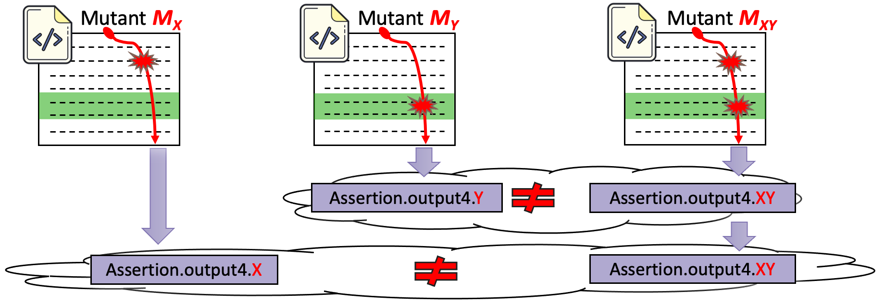

## Mutation Testing in Evolving Systems: Studying the relevance of mutants to code evolution 

* 👉 [Link to PitAssert framework](https://github.com/Ojda22/pitest/tree/pit-SOM-RM-AssertCache)

* 👉 [Link to Experiment Reproduction scripts](https://github.com/Ojda22/study_I)

* 👉 [Download data Part I](https://drive.google.com/drive/folders/1l1kP4IGXWi4ZXTbFPzxotkGx6xpCRoYY?usp=sharing) (⚠️ heavy file) 
* 👉 [Download data Part II](https://drive.google.com/drive/folders/1izO05GGMvvv29XG_Qa6bUTvv_6cGgO50?usp=sharing) (⚠️ heavy file) 

## Commit-Aware Mutation Testing Approach

  

